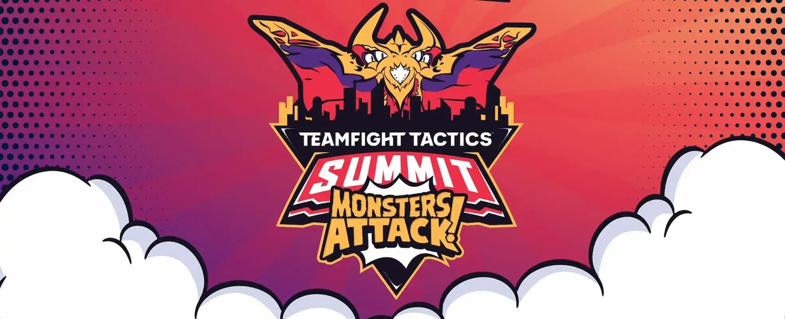

# TFT Player Stats Dashboard 

## Project Description

This project is a dashboard I created to showcase my own player stats using my match history for the game Teamfight Tactics, specifically for Set 8. The dashboard's base page displays number games played, average placement and etc based on the selected patch. In addition, it displays for the 1st, 2nd and 3rd Augments/power up which one I prefer to choose. The dashboard has the option to display number of times I played a specific character or specific trait along with my win rate for each patch. This dashboard allows me to look back and check if the choices I made were correct for each patch and point out any play style I need to improve on.

## Background

TFT(Teamfight Tactic) is a competitive strategy auto battler game created and managed by Riot. Players compete against 7 other players in a battle royale where they assemble a board of units to battle other players. TFT requires players to constantly make decisions based on the current game state. Some important decisions in TFT involves deciding whether to use resource to stronger for the moment or save the resource for compounding interest. TFT is updated every 2-3 weeks in the form of patch notes. These patch notes includes balancing changes which drastically changes the game's ecosystem, resulting in different team composition being good or bad depending on the patch. 

Augments - They are power ups offered at 3 different stages of the game. When augment selection occur you are offer 3 random augment and with a choice to reroll all three for a different option once per game. You are only allowed to pick one augment each augment selection.

Traits - Synergies between units that provide benefits to the entire team or all units sharing the same trait. Active traits are tier 1 by default and have different level of tiers, increasing as more units with the same trait is played. 

Units - Characters that are available to be played on your board. Units are 1 star by default and can go up to 2 and 3 star. Getting 3 copies of a unit will make it 2 star while 9 copies will make it 3 star. Generally having a higher star unit is better, but more difficult to obtain.

[main](https://github.com/RK0Gamer/Personal-Projects/blob/main/Identifying%20Trends%20in%20Popular%20Anime/Anime%20Data%20Analysis.ipynb) - Python Notebook used to extract, format, clean and store data from Riot API. 

[Dashboard](https://public.tableau.com/app/profile/kevin.diep/viz/PersonalTFTProfileDashboard/Unit) - The dashboard created to display player stats throughout Set 8. 

## Understanding the Dashboard

The main page shows number of game played, average overall placement and what percentage of games end up in a top 4. For reference, a placement of 4.5 is average and lower placement is considered better. On the upper right, there is a filter for which patch to show. This allow users to see their overall data, data from a specific patch or exclude a bad patch. This filter is applied to all dashboards.

Augments are sorted by which stage they are selected and how many times are they selected. Although the selection is random and limited, augments that have high pick count indicates a player's tendency to select the augment if it does appear. A high selection of augments with similar goals may outline a player's preferred play style. 

On the bottom right are selections boxes that switch between dashboards based on what information the user would like to see. There are 3 boxes: Player & Augment, Trait, and Units. The unit/trait dashboards are similar in structure, displaying # of times played, win rate of different tiers and # times played each patch with a unit/trait selector on the top right. The lower half of the dashboard shows all units/traits average placement, top 4 rate and # of times played. 

Please do note statistics in TFT is extremely misleading and context from the player themselves is often necessary to understand the full picture.

## Dataset
The dataset was taken retrieved from Riot API. The dataset contain a sample size of 220-240 games played for Set 8. The data is only a snapshot of each player's board when they lose, it doesn't contain what player played before the exact moment they lose or win the game. In addition, for this dashboard we exclude itemization because formatting the data is difficult and the nature of itemization make it difficult to draw useful information. Also our script doesn't take into account where a unit is played twice and so such instance is counted as once.

## Tools

Python - Used to send request to Riot API and preprocess the data

Tableau - Used to visualized data and build the dashboard