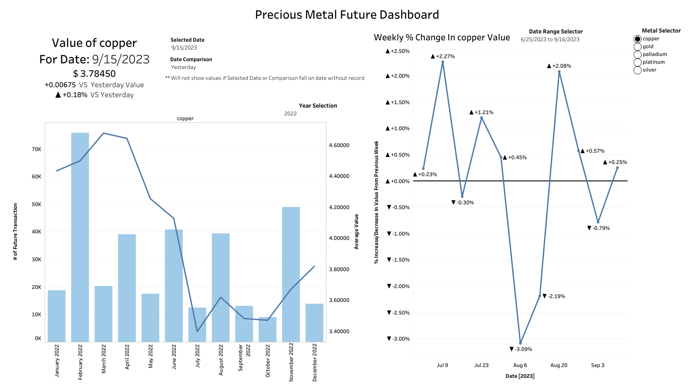

# Precious Metal Future Dashboard 

## Project Description

For this project, we wanted to create a report on copper, gold, palladium, platinum and silver future data. Using Python, we extracted the data from Yahoo Finance API and performed the necessary preprocessing. After processing the data, we used SQL to create and insert a table for each metal into SQL Server Management Studio(SSMS) for storage purposes. Next we ran a query within SSMS to create a combined table containing every data from every precious metal. This table is then converted into csv to import into Tableau Public. Using Tableau Public we create a report showcasing monthly transactions and trends in value percentage change. Our goal was to create a dashboard that showcase recent trend in market price of precious metal with the ability to view data on different time scales.

## Background
Futures are contracts made between two parties to buy a commodity at market price in specified date and time in the future. Understanding the current trends of market price is essential for deciding whether a buyer should buy a commodity at the moment or pursue a future contract. For a buyer if they expect market price to decrease then a future contract is more favorable. In addition, futures are common hedging tool used to minimize losses if the overall transaction turns out unprofitable while ensuring a profit is still made at a cost of profit margins. For this project we will be restricting the commodity to copper, gold, palladium, platinum and silver.

[Extract&Create DB Table](https://github.com/RK0Gamer/Personal-Projects/blob/main/Precious%20Metal%20Future%20Report/Extract%26Create%20DB%20Table.ipynb) - Python Notebook used to extract data, clean it and create database in SSMS

[SQL Server Script](https://github.com/RK0Gamer/Personal-Projects/tree/main/Precious%20Metal%20Future%20Report/SQL%20Server%20Script) - Script used in SSMS to combine separate tables.

[Dashboard](https://public.tableau.com/app/profile/kevin.diep/viz/MetalFutureReport/Dashboard1) - The dashboard created to trend in precious metal market price. 

## Understanding the Dashboard

This dashboard is design to see change in market price from different time scale. To change which metal commodity you want to see, use the filter on the top right. Since we were only provided with highest price and lowest for each day, we will be using the average of highest and lowest market price for comparison. 

Basic info for current market price, change in price with respect to a single date is provided on upper left. The bar graph showcase the number of future transaction that occur and the fluctuation of average price of each month. This showcase change in transaction with respect to change in market price. The Weekly % change graph shows change in recent week in term of percentage change. Continuous positive percentage change indicate market price is on an uptrend. 

## Dataset
The data was extracted from Yahoo Finance API from 1/4/2000 to 9/15/2023 for the following commodities: gold, copper, platinum, palladium and silver. The Yahoo Finance API is missing entries for a couple of dates. We assume the entries are missing because one of two reasons:
 1. The date falls on a holiday/weekend thus there is no trading occurring and nothing to record. 
 2. The API manager simply doesn't have market information recorded for that date. 

In addition, there are entries where the opening/closing price is higher/lower than highest/lowest price. Although we made correction for these cases, the error originated from the API still exist. Any work with the raw data from Yahoo API should be double checked.

### Column Dictionary
Opening price - market price of the commodity at the beginning of the day

Closing price - market price of the commodity at the end of the day

Highest price - peak market price of the entire day

Lowest price - lowest market price of the entire day

Transaction_count - number of exchanges that are future for that date

## Tools

Python - Used to extract data from Yahoo API, format data and store data into SMSS

SSMS(SQL Server Management Studio) - A data warehouse used to store dataset locally

Tableau - Used to visualize data and create dashboard

