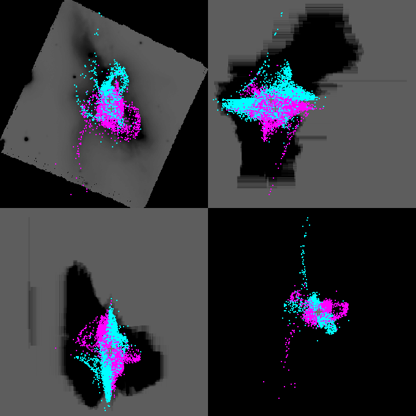

# Undergraduate Senior Project: Modeling Galaxy Merger

## Project Description
This is my academic research paper for my Astrophysics senior project. For this project I used a custom made program provided by my mentor to simulate colliding galaxies. The goal is to find a set of parameters that can recreate a galaxy merger similar to NGC 6240, a pair of galaxies in the process of being merged. The results of our simulation show a sufficiently large amount of dark matter is require to recreate NGC 6240. 

[Paper](https://github.com/RK0Gamer/Personal-Projects/blob/main/Undergrad%20Senior%20Project%20Modeling%20Galaxy%20Merger/Morphological%20Modeling%20of%20NGC%206240.pdf)

Comparison of simulated vs observed NGC 6240

